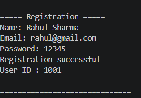
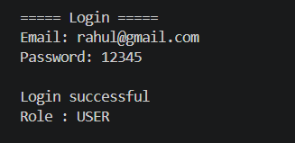
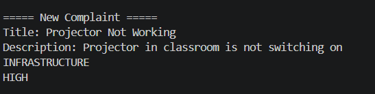
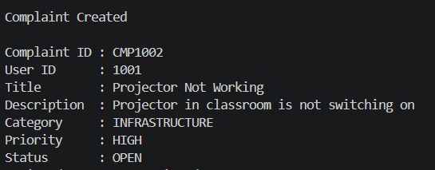
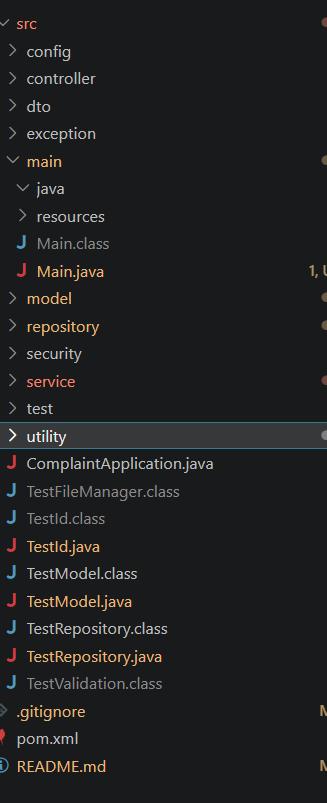

# Online Complaint Management System - Java

A console-based complaint management system built using Java and Object-Oriented Programming principles.

The application allows users to register, login, and submit complaints with different categories and priorities. The project follows a layered architecture similar to real-world enterprise applications.

---

# Features

## User Features

- User registration
- User login authentication
- Create complaints
- Generate unique complaint IDs
- View user complaints
- Input validation

## Complaint Management

- Complaint categories:
  - Technical
  - Billing
  - Service
  - Product
  - Infrastructure
  - Other

- Complaint priorities:
  - Critical
  - High
  - Medium
  - Low

## Architecture Features

- Object-Oriented Programming
- Repository Pattern
- Service Layer Pattern
- Model Driven Design
- Enum-based status management
- Modular package structure

---

# Project Architecture

src/

├── main/

│   └── Main.java

├── model/

│   ├── User.java

│   ├── Complaint.java

│   ├── Role.java

│   ├── ComplaintCategory.java

│   ├── ComplaintPriority.java

│   └── ComplaintStatus.java

├── repository/

│   ├── UserRepository.java

│   └── ComplaintRepository.java

├── service/

│   ├── UserService.java

│   └── ComplaintService.java

└── utility/

    ├── IdGenerator.java

    ├── ValidationUtil.java

    └── FileManager.java

---

# Technologies Used

- Java
- Object-Oriented Programming
- Collections Framework
- Exception Handling
- Java Enums
- Layered Architecture

---

# Application Workflow

User Registration

↓

User Login

↓

Create Complaint

↓

Assign Category

↓

Select Priority

↓

Generate Complaint ID

↓

Track Complaint Status

---

# Sample Output

Complaint Created Successfully

Complaint ID : CMP1002

User ID      : 1001

Title        : Projector is Not Working

Description  : Projector in classroom is not switching on

Category     : INFRASTRUCTURE

Priority     : HIGH

Status       : OPEN

---

# Screenshots

## Application Main Menu

Shows the starting menu where users can register, login, or exit.

## User Registration

User creates an account with name, email, and password.

## User Login

Authentication flow for registered users.

## Creating Complaint

User submits a complaint by entering title, description, category, and priority.

## Complaint Generated Successfully

System generates a unique complaint ID and displays complaint details.

## Project Structure

Layered architecture containing model, repository, service, and utility packages.

# How To Run

Clone repository:

git clone https://github.com/vyawaha/online-complaint-management-system-java.git

Compile:

javac -cp src src/model/*.java src/repository/*.java src/utility/*.java src/service/*.java

Compile Main:

javac -cp src src/main/Main.java

Run:

java -cp src main.Main

---

# Future Improvements

- Database integration using MySQL
- File-based persistence
- Complete Admin dashboard
- Complaint search and filtering
- REST API using Spring Boot
- Web-based frontend

---

# Learning Outcomes

Through this project I practiced:

- Java OOP concepts
- Software architecture design
- Repository and service patterns
- Clean code organization
- Building console-based enterprise applications

---

# Author

Muktai Vyawahare

Computer Science Engineering Student